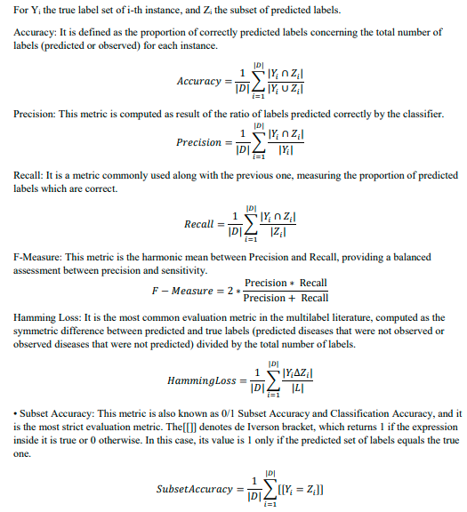

## **Performance measures to evaluate multi-label classifiers**  

In Multi-Label Tool we provide as model output, a table with four performance measures, accuracy, hamming loss, F-measure and subset accuracy: 

 

## **Feature Selection based on infogain**  

In this application we also provide as model output, a graph with information gain measures for each feature based on the binary relevance +information gain approach.This approach consists of first transforming the multi-label data into single-label datasets, one for each label, by Binary Relevance, and then use them to calculate Information Gain average scores. 

Infomation gain is a measure of features relevance to the model. From this measure, feature selection can be performed in order to reduce the amount of features as well as costs associated with the process of obtaining features. 

 

For more information:  
[rdocumentation](https://www.rdocumentation.org/packages/MultivariateRandomForest/versions/1.1/topics/MultivariateRandomForest)  
[randomForestSRC](https://cran.r-project.org/web/packages/randomForestSRC/randomForestSRC.pdf)   
[Multivariate Random Forest ](https://wires.onlinelibrary.wiley.com/doi/10.1002/widm.12)  
[Random Forest missing data algorithms](https://onlinelibrary.wiley.com/doi/10.1002/sam.11348)  
[ Multilabel classification with R package mlr](https://arxiv.org/pdf/1703.08991.pdf)  
[Multi‐label learning: a review of the state of the art and ongoing research](https://wires.onlinelibrary.wiley.com/doi/10.1002/widm.1139) 
[ Addressing imbalance in multilabel classification: Measures and random resampling algorithms](https://www.sciencedirect.com/science/article/abs/pii/S0925231215004269?via%3Dihub) 
[Spolaôr, Newton, et al.](https://www.sciencedirect.com/science/article/pii/S1571066113000121) 

 

